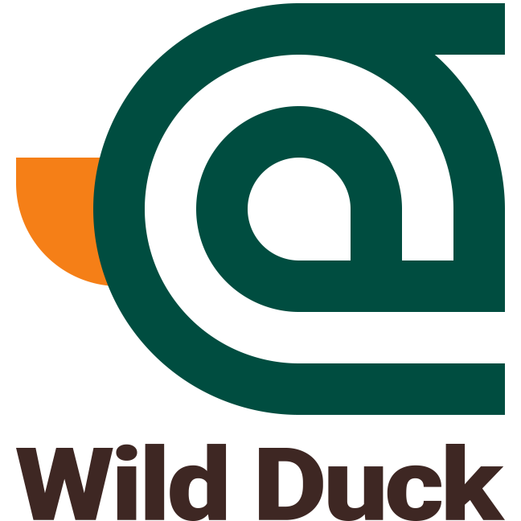

# WildDuck Mail Server

  
   
  WildDuck is a scalable no-SPOF IMAP/POP3 mail server.
   
  WildDuck uses a distributed database (sharded + replicated MongoDB) as a backend for storing all data, including emails.
   
  WildDuck tries to follow Gmail in product design.
   
  If there's a decision to be made then usually the answer is to do whatever Gmail has done.

  
  
  
  
  
  

## Links

- [Website](https://wildduck.email)
- [Documentation](https://docs.wildduck.email)
- [Installation instructions](https://docs.wildduck.email/#/general/install)
- [API Documentation](https://docs.wildduck.email/api)

## License

WildDuck Mail Agent is licensed under the [European Union Public License 1.2](https://joinup.ec.europa.eu/collection/eupl/eupl-text-eupl-12) or later.