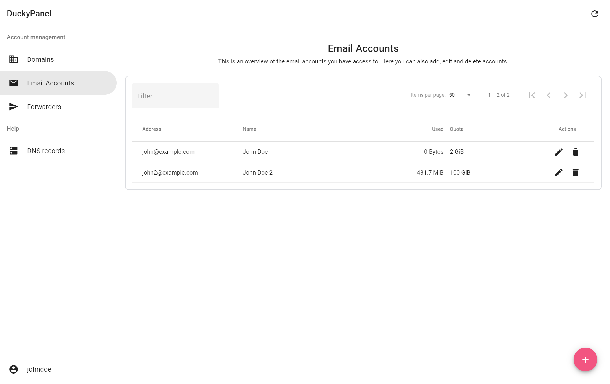
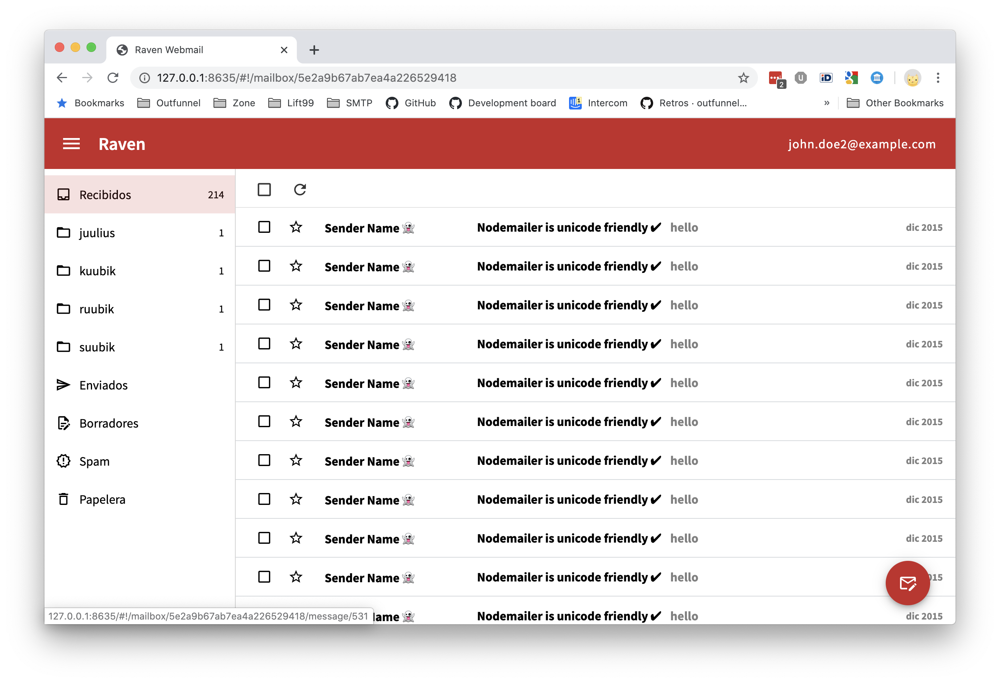
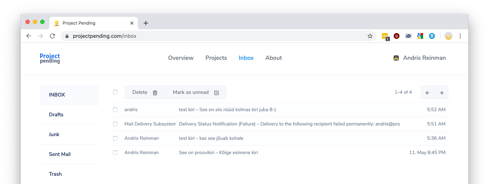
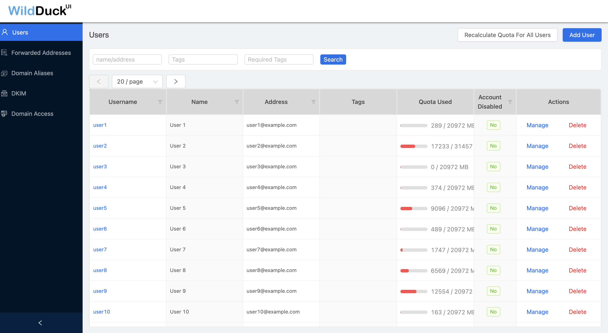

# Third party projects

This is an overview of any third party projects that integrate with or relate to WildDuck.

## Forward Email

https://forwardemail.net

Forward Email (@forwardemail) is a 100% open-source and privacy-focused email service that combines WildDuck with [an encrypted SQLite storage layer](https://forwardemail.net/blog/docs/best-quantum-safe-encrypted-email-service) and offers IMAP/POP3/SMTP/CalDAV and more.

## Astzweig Docker Wildduck

https://github.com/astzweig/docker-wildduck

The famous nodemailer/wildduck email server as a docker container.  
WildDuck, ZoneMTA, Haraka, rspamd in one image.

## DuckyPanel

https://github.com/louis-lau/DuckyPanel

DuckyPanel in combination with [DuckyAPI](https://github.com/louis-lau/DuckyAPI) is a domain admin control panel for WildDuck. It allows for multiple users, each owning specific domains. These users have full control over the domains and the accounts and forwarders within them.

## Raven Webmail

https://github.com/ramiroaisen/raven-webmail

A webmail for the wildduck mail server.

## Project Pending

https://projectpending.com/

Domain parking service that uses WildDuck for email storage and access.

## WildDuck UI

https://github.com/softwareartistry/wildduck-ui

Administrative UI for WildDuck IMAP server

