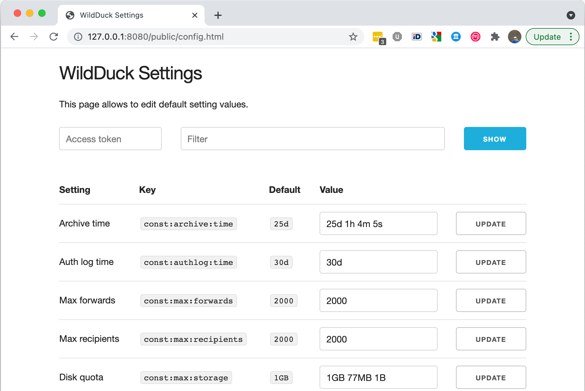

# Default values

You can set system wide defaults using either the [Settings API endpoints](https://docs.wildduck.email/api/#tag/Settings) or by using the built in API client for system settings.

You can find the client from API path _/public/config.html_, eg. if your API is running on port 8080 then the URL should be http://127.0.0.1:8080/public/config.html

If your API is configured to require authentication, then you need to provide either a _root_ token or a _settings_-role token. Otherwise you can leave the access token field empty.

**NB!** while the API endpoints only take milliseconds and byte values for duration and size key values, then the web based client allows to use human readable numbers, so you can use _30d_ instead of _2592000000_.
