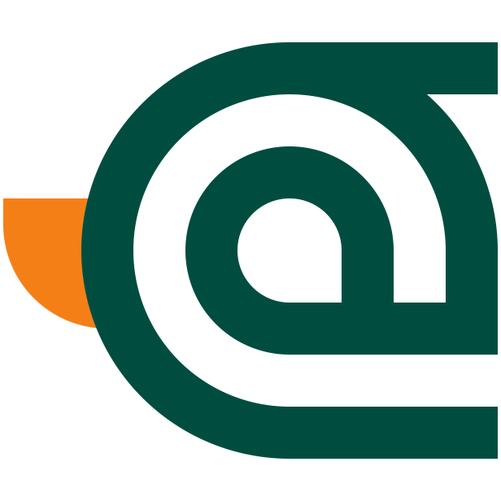

# WildDuck Graphics

## Color

Color palette pick from [Mallard](https://upload.wikimedia.org/wikipedia/commons/a/a1/Mallard2.jpg), using standard color from [Materialize Color](https://materializecss.com/color.html); .

1.  `#004d40 teal darken-4`
1.  `#f57f17 yellow darken-4`
1.  `#3e2723 brown darken-4`

## Logo

  Main logo of WildDuck
   
   
  

  Logo with <b>WildDuck</b> text using <a href="https://github.com/googlefonts/roboto">Roboto Font</a>
   
   
  

  Suitable for icon set, <a href="https://developer.apple.com/library/archive/documentation/AppleApplications/Reference/SafariWebContent/pinnedTabs/pinnedTabs.html">safari pinned tab</a> and etc...
   
   
  

## Tools

These list of tools that we used to create logo and generate optimize version.

- [node.js](https://nodejs.org/)
- [svgo](https://github.com/svg/svgo)
- [inkscape](https://inkscape.org/)
- [gimp](https://www.gimp.org/)
- [imagemagick](https://imagemagick.org/)
- [pngquant](https://pngquant.org/)